

# Football Shirt Collection

**Track, organize, and showcase your football shirt collection with a social platform for collectors**

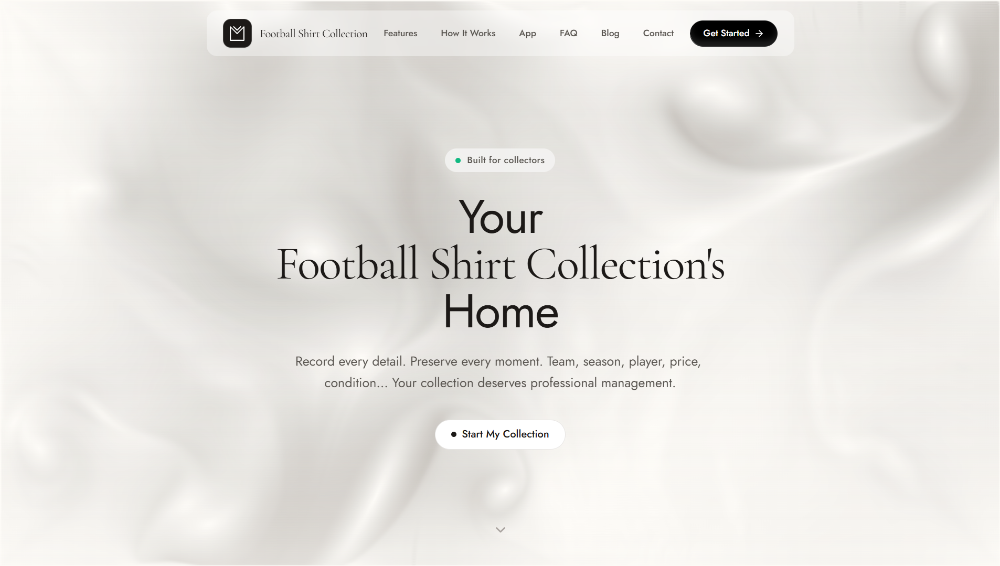

---

## About

As a football shirt collector, I found myself struggling to keep track of my growing collection. Spreadsheets felt clunky, notes got lost, and I had no way to visualize what I actually owned. So I built the tool I wished existed.

Football Shirt Collection is a modern web application that lets you catalog every jersey you own, track its value over time, and discover insights about your collection through beautiful charts and statistics. With the new social platform, you can follow other collectors, explore trending shirts, earn achievements, and build a community around your shared passion. Whether you have 5 shirts or 500, this app helps you organize, analyze, and showcase your collection.

---

## Features

### Collection Management
- Add shirts with comprehensive details: team, brand, season, condition, size, color, and purchase price
- Upload multiple images per shirt with drag-and-drop reordering
- Filter and sort your collection with advanced options
- Grid and table view layouts
- Mark player issue editions
- Visual color swatches for primary and detail colors

### Social & Explore
- Public profiles with bio, social links, and featured shirts
- Follow other collectors and build your network
- Like and save shirts from other collectors
- Threaded commenting system on shirt details
- Social feed with shirts from collectors you follow
- Explore page with popular collectors, trending shirts, and recent additions
- Leaderboard ranking top collectors
- User search to discover collectors
- Privacy controls for profile visibility

### Notifications & Achievements
- Real-time notifications for follows, likes, and comments
- Customizable notification preferences
- Achievement badges across categories: Collection, Diversity, Social, Wishlist, and Special
- Progress tracking toward each badge

### Statistics & Analytics
- Interactive dashboard with collection insights
- Charts showing distribution by team, brand, league, and more
- Track total collection value across multiple currencies
- Year-over-year growth analysis

### Wishlist
- Maintain a wishlist of desired shirts
- Set priority levels for items
- Track price history and availability

### Safety & Moderation
- Report inappropriate content with admin review workflow
- User blocking system
- Content moderation tools

### User Experience
- Dark and light theme support
- Fully responsive design for all devices
- Available in 6 languages: English, German, Spanish, French, Italian, Turkish
- Progressive Web App (PWA) support
- Changelog with version history
- What's New announcements for new features

### Security
- Secure authentication with Google OAuth and email/password
- JWT-based session management
- Protected API endpoints

---

## Screenshots

### Collection View
Browse and manage your shirts with powerful filtering and sorting capabilities.

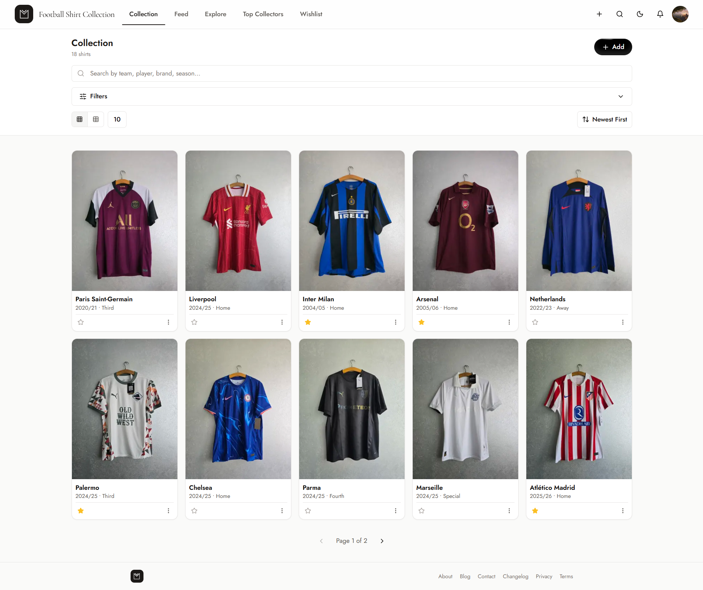

---

### Shirt Detail
View comprehensive shirt information with image gallery, color swatches, and social interactions.

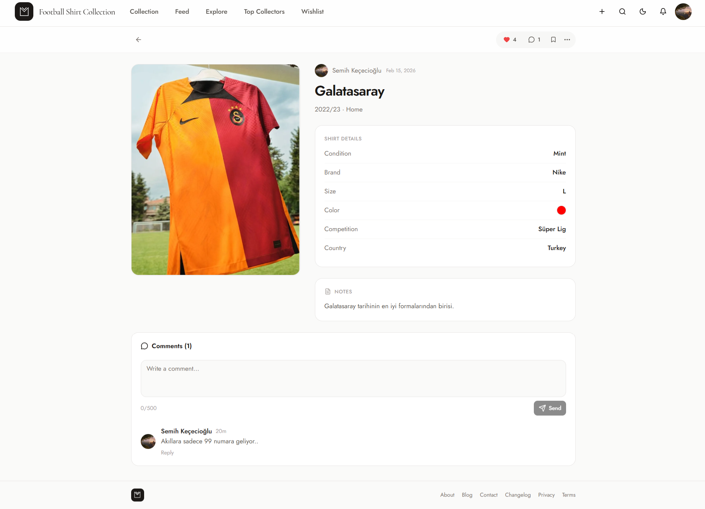

---

### Explore
Discover popular collectors, trending shirts, and the latest additions from the community.

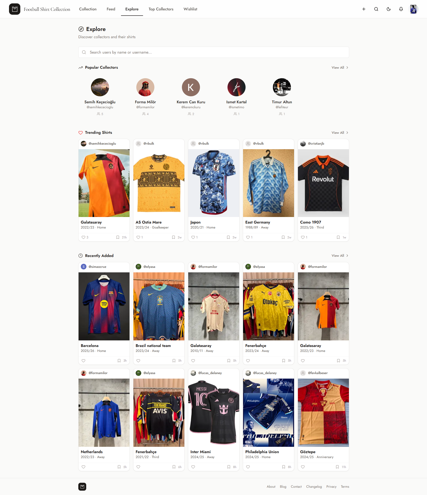

---

### Public Profile
Showcase your collection with a public profile, follower stats, and featured shirts.

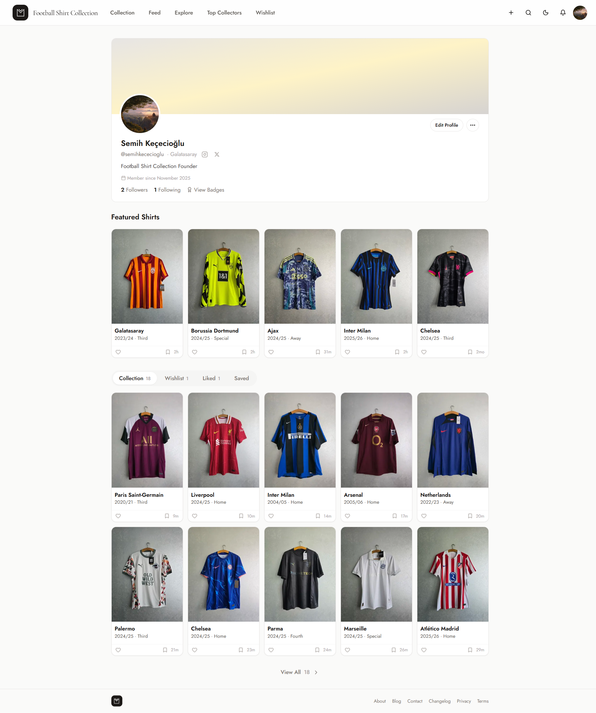

---

### Social Feed
Stay up to date with shirts from collectors you follow.

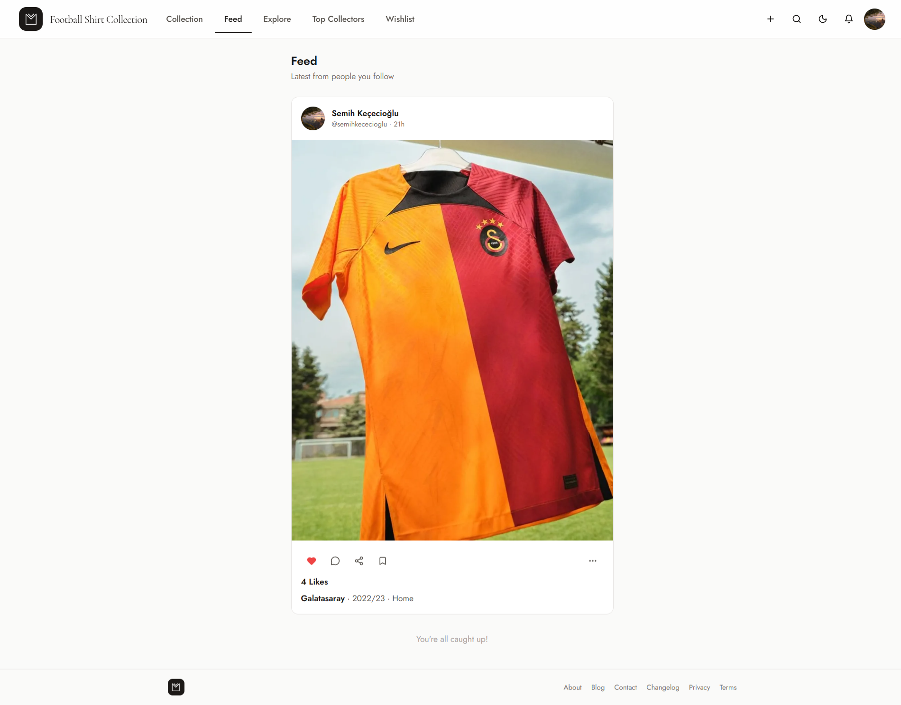

---

### Achievements
Earn badges and track your progress across multiple categories.

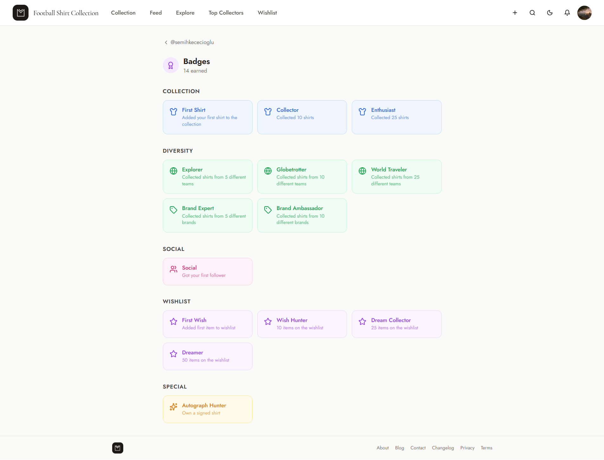

---

### Leaderboard
See top collectors ranked by collection size and likes received.

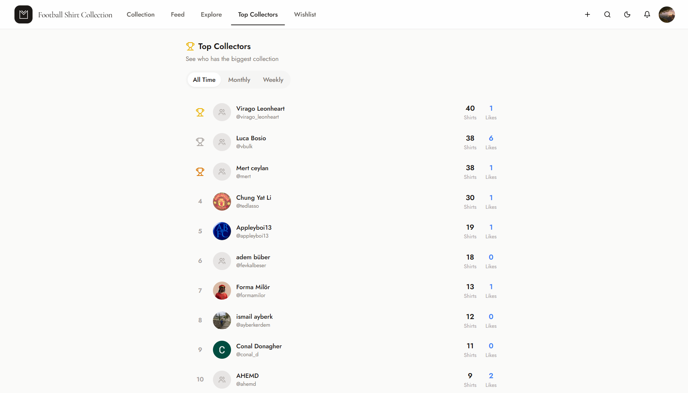

---

### Notifications
Stay informed with real-time alerts for follows, likes, and comments.

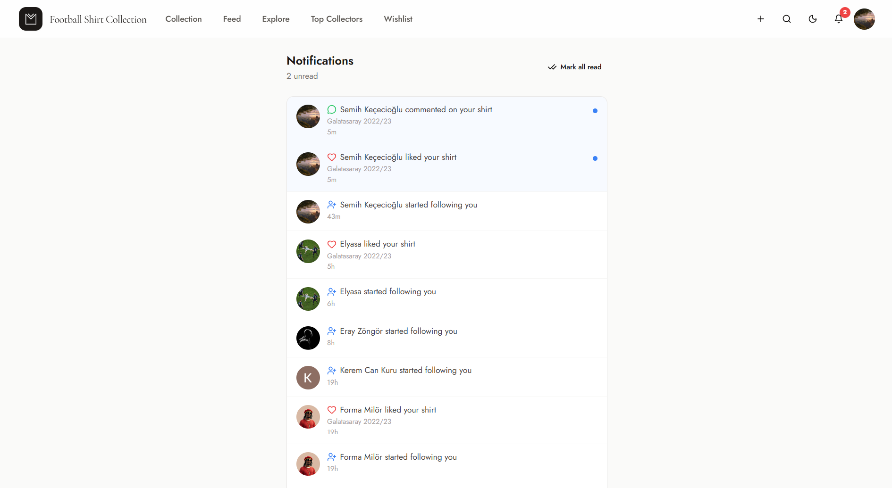

---

### Statistics Dashboard
Gain insights into your collection with interactive charts and detailed analytics.

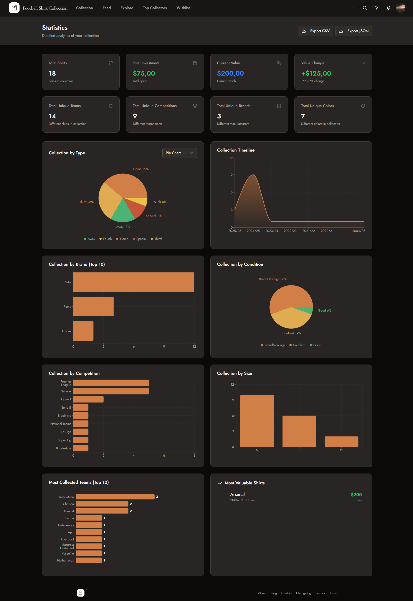

---

### Wishlist
Keep track of the shirts you want to add to your collection.

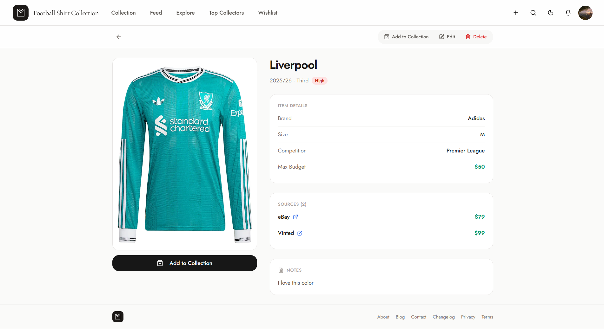

---

### Dark Mode
A carefully crafted dark theme for comfortable viewing.

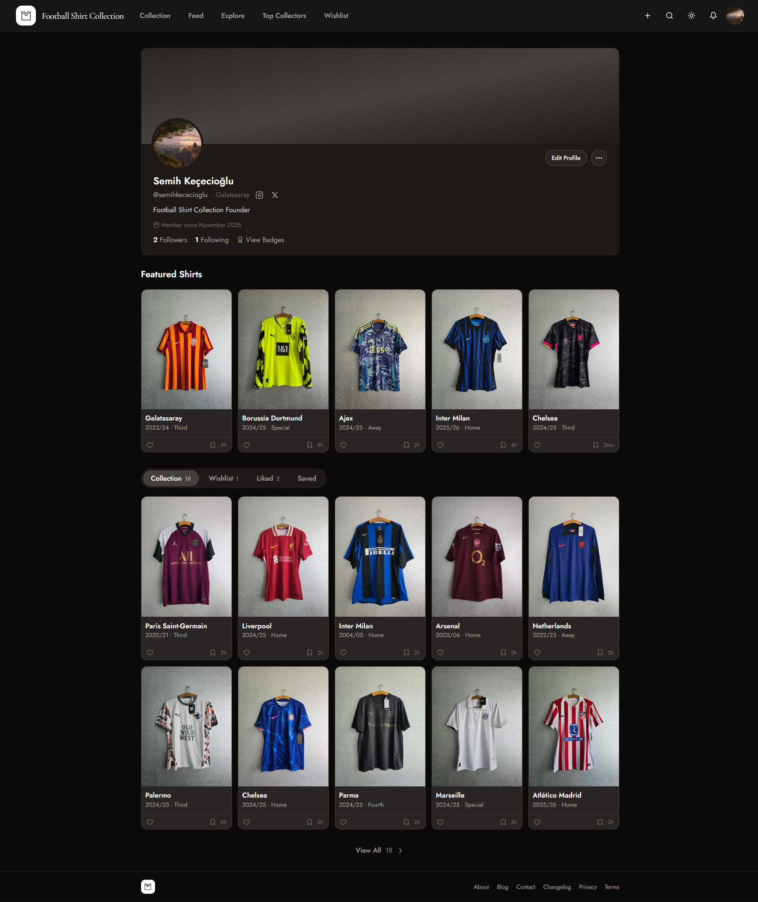

---

### Mobile Experience
Fully responsive design that adapts to any screen size.

  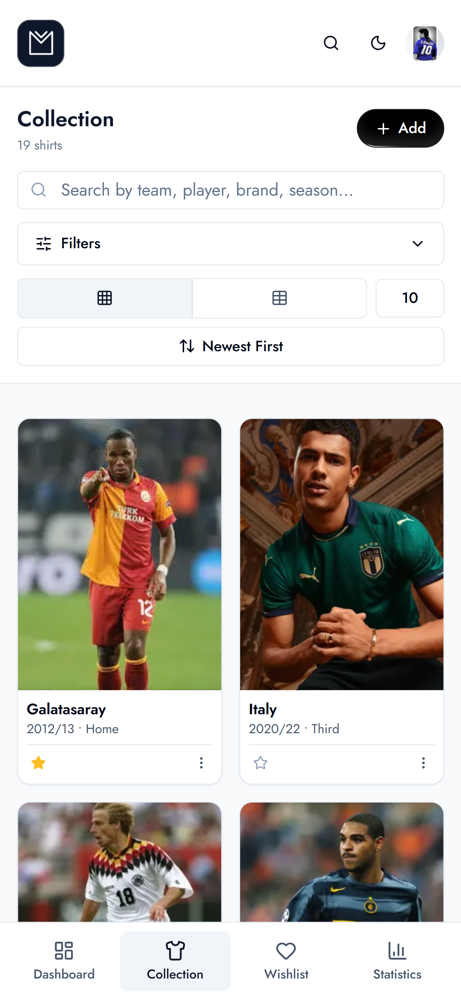

---

## Tech Stack

### Frontend

| Technology | Purpose |
|------------|---------|
| React 18 | UI Framework |
| Vite 6 | Build Tool |
| TailwindCSS | Styling |
| shadcn/ui | Component Library |
| React Query | Server State Management |
| React Router v6 | Routing |
| Recharts | Data Visualization |
| i18next | Internationalization |
| React Hook Form | Form Management |
| Zod | Schema Validation |

### Backend

| Technology | Purpose |
|------------|---------|
| Node.js | Runtime |
| Express | Web Framework |
| MongoDB | Database |
| Mongoose | ODM |
| JWT | Authentication |
| Cloudinary | Image Storage |
| Nodemailer | Email Service |

### Infrastructure & Monitoring

| Service | Purpose |
|---------|---------|
| Vercel | Frontend Hosting |
| Railway | Backend Hosting |
| Firebase Analytics | User Analytics |
| Vercel Analytics | Web Analytics |
| Vercel Speed Insights | Performance Monitoring |
| Sentry | Error Tracking |
| Microsoft Clarity | Session Recording |

---

## Links

- **Live Demo:** [footballshirtcollection.app](https://footballshirtcollection.app)
- **Contact:** [footballshirtcollection.app/contact](https://footballshirtcollection.app/contact)

---

## Author

<table>
  <tr>
    <td align="center">
      <strong>Semih Keçecioğlu</strong>
       
      <a href="mailto:semihkecec@gmail.com">semihkecec@gmail.com</a>
       
      <a href="https://twitter.com/semihkececioglu">@semihkececioglu</a>
    </td>
  </tr>
</table>

---

## License

This repository is for showcase purposes only. The source code is private.

---

**Made for football shirt collectors worldwide**

